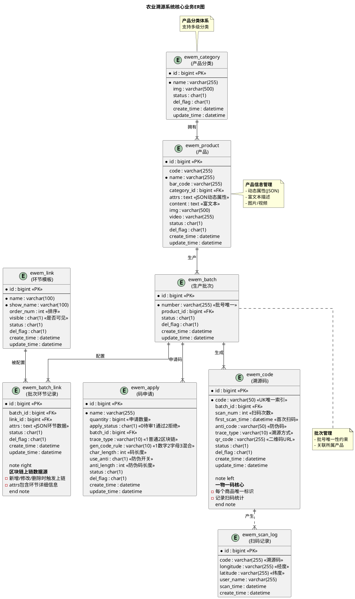
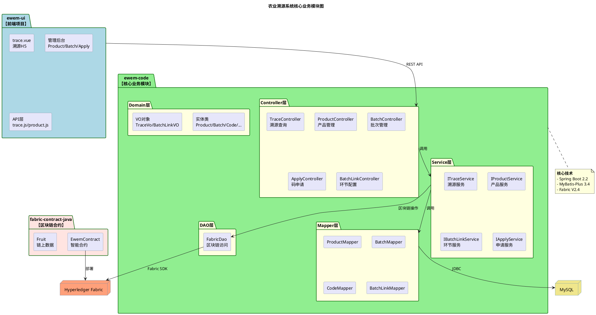
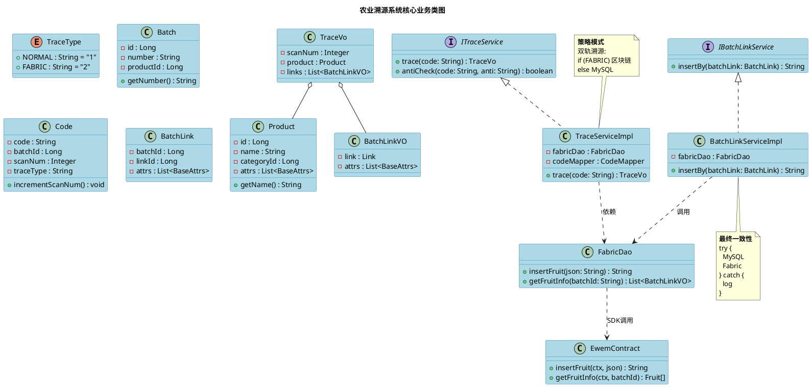
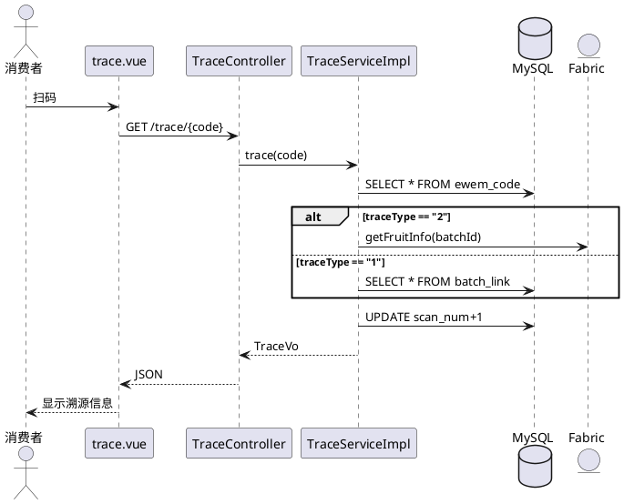

# 农业溯源系统核心业务UML设计图

## 概述

本文档包含农业溯源系统(ewem-fabric-trace-java)的**核心业务功能**UML 2.0标准设计图,已去除若依(RuoYi)框架相关的通用模块(用户管理、角色管理、菜单管理等),聚焦于**一物一码防伪溯源**核心业务。

所有图表采用PlantUML格式,可直接导入draw.io进行可视化和编辑。

## 图表清单

| 序号 | 图表名称 | 说明 | 核心内容 |
|------|---------|------|---------|
| 1 | 核心业务ER图 | 8个核心业务表及关系 | 分类-产品-批次-码-环节-扫码 |
| 2 | 核心模块结构图 | 溯源业务模块划分 | ewem-code + 前端 + 区块链合约 |
| 3 | 核心层次结构图 | Controller-Service-Mapper分层 | 双轨溯源+区块链集成 |
| 4 | 核心功能结构图 | 溯源业务功能树 | 查询/产品/批次/码/统计 |
| 5 | 核心业务类图 | 30+核心业务类 | Service/Mapper/Entity/VO |
| 6 | 顺序图(4个) | 扫码查询/环节上链/申请生码/防伪验证 | 核心业务流程 |

## 快速开始

### 导入draw.io步骤

1. **打开draw.io**: https://app.diagrams.net/

2. **插入PlantUML**: `排列` → `插入` → `高级` → `PlantUML`

3. **粘贴代码**: 复制下方对应图表的PlantUML代码

4. **生成图表**: 点击"插入"按钮

5. **导出图片**: `文件` → `导出为` → PNG/SVG/PDF

---

## 1. 核心业务ER图

展示8个核心业务表:category、product、batch、link、batch_link、apply、code、scan_log



---

## 2. 核心模块结构图



---

## 3. 核心层次结构图

```plantuml
@startuml
' =====================================================
' 农业溯源系统 - 核心业务分层架构
' =====================================================

skinparam backgroundColor white
skinparam component {
  BackgroundColor LightBlue
  BorderColor SteelBlue
  ArrowColor DarkSlateGray
}

title 农业溯源系统核心业务分层架构

package "客户端" as client {
  component [消费者\n微信扫码] as consumer
  component [管理员\nWeb浏览器] as admin
}

package "前端Vue" as frontend {
  component [trace.vue\n溯源H5] as trace_page
  component [Axios封装] as axios
}

package "Controller层" as controller {
  component [TraceController\n溯源查询] as trace_ctrl
  component [Product/Batch/Apply Controller] as biz_ctrl
}

package "Service层" as service {
  component [TraceServiceImpl\n双轨溯源策略\n@Transactional] as trace_svc
  component [BatchLinkServiceImpl\n环节上链服务] as batchlink_svc
}

package "Mapper/DAO层" as dao {
  component [Product/Batch/Code Mapper] as mappers
  component [FabricDao\n区块链访问] as fabricdao
}

package "Domain层" as domain {
  component [Product/Batch/Code] as entities
  component [TraceVo/BatchLinkVO] as vos
}

package "数据存储" as storage {
  artifact [[MySQL]] as mysql
  artifact [[Hyperledger Fabric]] as fabric
}

' 连接关系
consumer --> trace_page : 扫码
admin --> biz_ctrl : Web访问
trace_page --> axios : API调用
axios --> trace_ctrl : GET /trace/{code}
axios --> biz_ctrl : CRUD

trace_ctrl --> trace_svc : trace(code)
biz_ctrl --> service : CRUD

trace_svc --> mappers : 查询
trace_svc --> fabricdao : 区块链查询\n(traceType=2)
batchlink_svc --> fabricdao : 上链操作

mappers --> mysql : JDBC
fabricdao --> fabric : Fabric SDK

entities <-- mappers : 映射
vos <-- service : 组装

note right of trace_svc
  <b>双轨溯源</b>
  if (traceType==FABRIC) {
    从区块链查询
  } else {
    从MySQL查询
  }
end note

note bottom of batchlink_svc
  <b>最终一致性</b>
  try {
    MySQL保存
    Fabric上链
  } catch {
    记录日志
  }
end note

@enduml
```

---

## 4. 核心功能结构图

```plantuml
@startuml
' =====================================================
' 农业溯源系统 - 核心功能结构图
' =====================================================

skinparam backgroundColor white
skinparam package {
  BackgroundColor LightYellow
  BorderColor DarkGreen
}
skinparam rectangle {
  BackgroundColor LightBlue
  BorderColor SteelBlue
}
skinparam circle {
  BackgroundColor Lavender
  BorderColor Purple
}

title 农业溯源系统核心功能结构图

rectangle "<b>农业溯源系统</b>" as root #LightCyan

package "溯源查询\n(消费者端)" as trace_module #LightGreen {
  rectangle "溯源码查询" as trace_query
  trace_query ---
  circle "扫码/输入code" as tq1
  circle "双轨策略选择" as tq2
  circle "查询Product/Batch" as tq3
  circle "查询环节链路" as tq4
  circle "更新扫码统计" as tq5
  circle "记录扫码日志" as tq6
  
  rectangle "防伪验证" as anti_check
  anti_check ---
  circle "输入防伪码" as ac1
  circle "比对anti_code" as ac2
}

package "产品管理" as product_module #LightBlue {
  rectangle "产品分类" as cat_func
  cat_func ---
  circle "分类CRUD" as c1
  circle "图片上传" as c2
  
  rectangle "产品信息" as prod_func
  prod_func ---
  circle "产品CRUD" as p1
  circle "动态属性(JSON)" as p2
  circle "富文本编辑" as p3
}

package "批次管理" as batch_module #LightSalmon {
  rectangle "批次信息" as batch_func
  batch_func ---
  circle "批次CRUD" as b1
  circle "批号唯一校验" as b2
  
  rectangle "环节配置" as link_func
  link_func ---
  circle "环节模板管理" as l1
  circle "批次环节绑定" as l2
  circle "填写环节属性" as l3
  
  rectangle "区块链上链" as bc_func #Khaki
  bc_func ---
  circle "自动触发上链" as bc1
  circle "获取交易ID" as bc2
}

package "码管理" as code_module #Wheat {
  rectangle "码申请" as apply_func
  apply_func ---
  circle "提交申请" as af1
  circle "选择溯源方式" as af2
  circle "配置生码规则" as af3
  circle "防伪码开关" as af4
  
  rectangle "申请审核" as audit_func
  audit_func ---
  circle "审核通过/拒绝" as aud1
  circle "触发批量生码" as aud2
  
  rectangle "溯源码生成" as codegen_func
  codegen_func ---
  circle "按规则生成唯一码" as cg1
  circle "批量插入数据库" as cg2
  circle "生成二维码" as cg3
}

package "统计分析" as stats_module #Plum {
  rectangle "扫码统计" as scan_stats
  scan_stats ---
  circle "扫码次数累加" as ss1
  circle "首次扫码时间" as ss2
  circle "扫码日志记录" as ss3
  circle "GPS位置记录" as ss4
}

root --> trace_module
root --> product_module
root --> batch_module
root --> code_module
root --> stats_module

note bottom of trace_query
  <b>溯源查询流程</b>
  1. 扫码获取code
  2. 查询Code表
  3. 根据traceType选择:
     - 区块链: Fabric查询
     - 普通: MySQL查询
  4. 组装TraceVo返回
  5. 更新扫码统计
end note

note right of bc_func
  <b>上链时机</b>
  - 新增环节时
  - 修改环节时
  - 删除环节时
  
  容错: 失败不回滚
end note

@enduml
```

---

## 5. 核心业务类图

由于篇幅限制,这里提供简化版,完整代码见前文对话。



---

## 6. 顺序图

### 6.1 用户扫码溯源查询

完整代码见前文对话,此处为简化示意:



### 6.2 批次环节上链

完整代码见上方"顺序图2"部分。

### 6.3 溯源码申请与生成流程

```plantuml
@startuml
' =====================================================
' 顺序图3: 溯源码申请与生成流程(核心业务)
' =====================================================

skinparam backgroundColor white
skinparam participant {
  BackgroundColor LightBlue
  BorderColor SteelBlue
}
skinparam actor {
  BackgroundColor LightYellow
  BorderColor DarkGreen
}
skinparam database {
  BackgroundColor Lavender
  BorderColor Purple
}

title 溯源码申请与生成顺序图

actor "管理员" as admin #LightCyan
participant "Apply管理页" as frontend #LightGreen
participant "ApplyController" as controller
participant "ApplyServiceImpl" as applyService
participant "CodeHandle\n(码生成工具)" as codeHandle
participant "CodeMapper" as codeMapper
database "MySQL" as mysql #Khaki

activate admin
activate frontend

== 1. 提交码申请 ==
admin -> frontend : 填写申请信息:\n- 申请名称/数量\n- 选择批次\n- 溯源方式\n- 生码规则\n- 码长度/防伪配置
frontend -> controller : POST /ewem/apply
activate controller
controller -> applyService : insertBy(apply)
activate applyService

== 2. 保存申请(状态=待审核) ==
applyService -> applyService : apply.setApplyStatus("0")
applyService -> mysql : INSERT INTO ewem_apply\n(申请信息, apply_status='0')
activate mysql
mysql --> applyService : 插入成功
deactivate mysql
applyService --> controller : true
deactivate applyService
controller --> frontend : AjaxResult.success()
deactivate controller
frontend --> admin : "申请提交成功,等待审核"

== 3. 审核申请 ==
admin -> frontend : 选择申请\n点击"审核通过"
activate frontend
frontend -> controller : PUT /ewem/apply\n{applyStatus="1"}
activate controller
controller -> applyService : updateBy(apply)
activate applyService

== 4. 校验并更新状态 ==
applyService -> mysql : SELECT * FROM ewem_apply WHERE id=?
activate mysql
mysql --> applyService : Apply对象
deactivate mysql

alt 状态不是INIT
  applyService --> controller : 抛出异常
  controller --> frontend : error("已处理过")
  stop
end

applyService -> mysql : UPDATE ewem_apply SET\napply_status='1' WHERE id=?
activate mysql
mysql --> applyService : 更新成功
deactivate mysql

== 5. 批量生成溯源码 ==
applyService -> codeHandle : generateCodes(apply)
activate codeHandle

loop 遍历quantity次(如1000次)
  codeHandle -> codeHandle : 根据规则生成唯一code\n(纯数字/纯字母/混合)
  
  alt useAnti == true
    codeHandle -> codeHandle : 生成防伪码antiCode
  end
  
  codeHandle -> codeHandle : 创建Code对象\n(code, batchId, traceType,\nantiCode, scanNum=0)
end

codeHandle --> applyService : List<Code> (1000个)
deactivate codeHandle

== 6. 批量插入数据库 ==
applyService -> codeMapper : batchInsert(codes)
activate codeMapper
codeMapper -> mysql : INSERT INTO ewem_code\nVALUES (...), (...), ...
activate mysql
mysql --> codeMapper : 插入成功(1000条)
deactivate mysql
codeMapper --> applyService : 返回数量
deactivate codeMapper

== 7. 返回结果 ==
applyService --> controller : "已生成1000个溯源码"
deactivate applyService
controller --> frontend : AjaxResult.success(msg)
deactivate controller
frontend --> admin : "审核通过,已生成1000个码"
deactivate frontend
deactivate admin

@enduml
```

### 6.4 防伪验证流程

```plantuml
@startuml
' =====================================================
' 顺序图4: 防伪验证流程(核心业务)
' =====================================================

skinparam backgroundColor white
skinparam participant {
  BackgroundColor LightBlue
  BorderColor SteelBlue
}
skinparam actor {
  BackgroundColor LightYellow
  BorderColor DarkGreen
}
skinparam database {
  BackgroundColor Lavender
  BorderColor Purple
}

title 防伪验证顺序图

actor "消费者" as user #LightCyan
participant "trace.vue" as frontend #LightGreen
participant "TraceController" as controller
participant "TraceServiceImpl" as service
participant "CodeMapper" as codeMapper
database "MySQL" as mysql #Khaki

activate user
activate frontend

== 1. 输入防伪码 ==
user -> frontend : 输入防伪码\n(刮开涂层可见)\n例: "X7K2M9P3"
frontend -> controller : GET /trace/anti/{code}?\nantiCode={inputCode}
activate controller
controller -> service : antiCheck(code, inputAntiCode)
activate service

== 2. 查询溯源码 ==
service -> codeMapper : selectOneByCode(code)
activate codeMapper
codeMapper -> mysql : SELECT * FROM ewem_code\nWHERE code = ?
activate mysql

alt 溯源码不存在
  mysql --> codeMapper : null
  codeMapper --> service : null
  service --> controller : false
  controller --> frontend : success(false)
  frontend --> user : ❌ "溯源码不存在"
  deactivate all
  stop
end

mysql --> codeMapper : Code对象
deactivate mysql
codeMapper --> service : code
deactivate codeMapper

== 3. 检查是否启用防伪 ==
alt code.antiCode为空
  service --> controller : false
  controller --> frontend : success(false)
  frontend --> user : ⚠️ "未启用防伪验证"
  deactivate all
  stop
end

== 4. 比对防伪码 ==
service -> service : inputAntiCode.equals(code.antiCode)

alt 防伪码匹配
  service --> controller : true
  controller --> frontend : success(true)
  frontend --> frontend : 显示绿色提示框
  frontend --> user : ✅ "验证成功,正品确认"
  
else 防伪码不匹配
  service --> controller : false
  controller --> frontend : success(false)
  frontend --> frontend : 显示红色警告框
  frontend --> user : ❌ "防伪码错误,可能为假冒产品"
end

deactivate service
deactivate controller
deactivate frontend
deactivate user

note bottom of service
  <b>防伪码说明</b>
  
  **生成**: 申请审核时批量生成
  **规则**: 随机字符串(6-12位)
  **存储**: ewem_code.anti_code字段
  **验证**: 简单字符串比对
  **安全**: 一物一码,刮开涂层
end note

@enduml
```

---

## 关键设计说明

### 1. 双轨溯源策略

系统支持两种溯源方式:
- **普通溯源**(traceType="1"): 数据存储在MySQL
- **区块链溯源**(traceType="2"): 数据同时存储在MySQL和Fabric

查询时根据`traceType`动态选择数据源。

### 2. 最终一致性设计

区块链操作采用try-catch容错:
```java
try {
    save(batchLink);           // MySQL
    fabricDao.insert(fruit);   // Fabric
} catch (Exception e) {
    log.error("上链失败", e);  // 不回滚
}
```

区块链失败不影响主业务流程,后续可通过对账任务修复。

### 3. 动态属性系统

产品和环节使用JSON格式存储动态属性:
```json
[
  {"k": "产地", "v": "烟台"},
  {"k": "品种", "v": "红富士"}
]
```

支持灵活扩展,无需修改表结构。

### 4. 一物一码机制

- 每个商品分配唯一溯源码(code字段唯一索引)
- 扫码时自动累加scan_num
- 记录首次扫码时间first_scan_time
- 可选生成防伪码(anti_code)

---

## 技术栈

**后端**:
- Spring Boot 2.2.13
- MyBatis-Plus 3.4.3
- Hyperledger Fabric V2.4
- JWT认证

**前端**:
- Vue 2.6.12
- Element UI 2.15.5
- Axios 0.21.0

**数据库**:
- MySQL 5.5+
- Redis (缓存)
- Hyperledger Fabric (区块链)

---

## 常见问题

**Q: 如何查看完整的类图和顺序图?**

A: 请查阅前文对话中的完整代码,或访问计划文件:
`C:\Users\MR\AppData\Roaming\Lingma\SharedClientCache\cli\specs\uml-design-diagrams.md`

**Q: draw.io无法识别PlantUML?**

A: 确保使用最新版draw.io,或通过在线编辑器http://www.plantuml.com/plantuml/生成图片后导入。

**Q: 如何自定义图表样式?**

A: 修改skinparam参数,或在draw.io中手动调整元素颜色和布局。

---

**生成时间**: 2026-04-08  
**系统版本**: ewem-fabric-trace-java v1.0  
**文档作者**: Lingma AI Assistant
