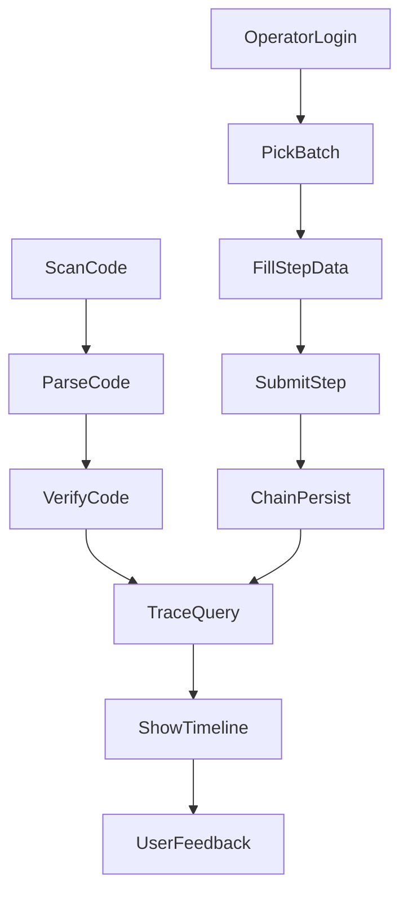

# ΢��С�����ҵ��ջ����ַ�����һ�ڣ�v1.0

## 0. �ĵ���Ϣ

- �ĵ��汾��v1.0
- ���ý׶Σ�һ�ڣ���С���ñջ���
- ����ϵͳ��`ewem-admin`��`ewem-code`��`fabric-contract-java`
- ���Ŀ�꣺��Ϊ M0 ������������������ԡ�����Ψһ�����ĵ�

---

## 1. ǿ��ԭ�򣨱��ڱ������أ�

1. **�������д���ʵ��**��������չ����ģ�飬���½�ƽ��ҵ��ϵͳ��  
2. **��������������**�����̵� `ewem-admin`��`ewem-code` ���нӿڣ��޷�����ʱ������С������  
3. **�ĵ�ǰ��**���ӿ��ĵ�������/��Ӧ/������/��Ȩ/�ݵȣ�����ͨ�����ٿ�����  
4. **�淶����**���ϸ���ѭ������Ͱ� Java �����ֲᡷ��������Ŀ����淶��  
5. **���ݲ��ƻ�**��������������Ӱ���̨���е��÷������ݿھ���  

---

## 2. һ��Ŀ����߽�

## 2.1 һ��Ŀ��

ʵ�֡�**����ɲ顢��¼����׷���ɷ���**����Сҵ��ջ���

- �ɲ飺������ɨ���������������Դ��ѯ��
- ��¼����ҵ��ɫ����ɹؼ�����¼�룻
- ��׷���ؼ��¼��߱�����֤ƾ֤��������״̬����
- �ɷ����������߿��ύ������������׷�ٴ���״̬��

## 2.2 ���ǽ�ɫ

- �����ߣ�C �ˣ�
- ��ҵ��ɫ��B ������ҵ������ֲ������������������

## 2.3 ������һ�ڷ�Χ

- ����Ӫ���̳�
- ����֯����
- ����Ӫ�����
- BI ��ȷ���

---

## 3. ҵ������ģ�黮��

## 3.1 ��������C �ˣ�

- ɨ����ڣ�������Դ��/��α�룻
- ������ҳ������ж����ظ�ɨ����ʾ��������ʾ��
- ��Դ��·ҳ�����Ρ����ء��ӹ�������������ʱ���᣻
- �����ջ���Ͷ��/����/�ۺ������ύ��

## 3.2 ��ҵ��ҵ��B ������ҵ��

- ��¼�������л�������ҵ��ɫ��ʾ���ù��ܣ�
- �������Ʒѡ�񣺶�λ¼�����
- ����¼�룺��ģ��¼��ʱ�䡢�ص㡢�����ˡ�ͼƬ���ֶΣ�
- �ύ��֤����¼����״̬�����׹�ϣ��ʧ�����Խ����

## 3.3 ����������

- �˺���Ȩ�ޣ�΢�ŵ�¼�󶨺�̨�˺š�JWT �Ự���ڣ�
- �����¼����ͳһ��װɨ�롢��ѯ���ύ API��
- ��Ϣ֪ͨ��¼����졢�쳣�澯���������ѡ�

---

## 4. һ�ڹؼ�����

---

## 5. ǰ���ְ�𻮷�

- С����ˣ��������ɼ�����У�顢����������״̬���ӻ���
- Java ��ˣ�Ȩ�ޡ�ҵ�����ģ��������ݵȡ����۸�У�顢����д�룻
- ����������/��Լ���ؼ��¼���ϣ��֤�����֤��ѯ��
- ���ȸ���ģ�飺`ewem-admin`��`ewem-code`��`fabric-contract-java`��

---

## 6. �ӿڲ��ԣ��������ȣ�

## 6.1 ִ�в���

1. **�̵�**���������� Controller/Service ������������ɸ���/ȱ�ڡ��嵥��  
2. **ӳ��**��С����ҳ�涯������ӳ�����нӿڣ�  
3. **��ȱ**�����Բ��ɸ����������� `mini` ǰ׺�ӿڣ�  
4. **����**��ͳһ `AjaxResult`��ͳһ��Ȩ��ͳһ�����룬���ƻ����е��á�  

## 6.2 һ���������飨���ջ���

- ������֤��`/mini/code/parse`��`/mini/code/verify`
- ��Դ��ѯ��`/mini/trace/{code}`��ʱ���� + ����ƾ֤��
- ����¼�룺`/mini/trace/step/save`��`/mini/trace/step/submit`
- ����״̬��`/mini/trace/chain/status/{bizId}`
- ����������`/mini/feedback/create`��`/mini/feedback/list`

> ˵��������Ϊ�������飬������ȫ��������ÿ���ӿڱ��븽��������Դ��ȱ�����ݡ���

---

## 7. M0 �����嵥������ǰ����ɣ�

## 7.1 �ɸ��� API ������

- ��¼��Ȩ��`POST /login`��`GET /getInfo`  
  - λ�ã�`SysLoginController.java`
- ������ɨ�����棺`GET /trace/{code}`��`GET /trace/anti/{code}?antiCode=xxx`  
  - λ�ã�`TraceController.java`
- ��ҵ¼��������ݣ�`GET /ewem/batch/list`��`GET /ewem/link/list`  
  - λ�ã�`BatchController.java`��`LinkController.java`
- ��ҵ����¼�룺`POST /ewem/batchLink`��`PUT /ewem/batchLink`��`GET /ewem/batchLink/list`  
  - λ�ã�`BatchLinkController.java`

## 7.2 ��С�����ӿڣ�����ȱ�ڣ�

- `POST /mini/login`��`wxCode -> token`������΢�����ܵ�¼���룩
- `POST /mini/feedback`
- `GET /mini/feedback/{id}`
- `GET /ewem/batchLink/{id}/chain-status`��`txId`��״̬��ʧ��ԭ��

## 7.3 ͳһ�������������븴�ã�

- ͳһ��Ӧ��`AjaxResult.java`
- ���������ࣺ`BaseController.java`
- ��Ȩ��·��`SecurityConfig.java`��`JwtAuthenticationTokenFilter.java`��`TokenService.java`

---

## 8. �ӿ��ĵ�������׼������ǰ�ã�

- �ĵ�˫�ݲ�����OpenAPI/Swagger + Markdown ҵ��˵����
- ÿ���ӿڱ��������
  - ��;��Ȩ�ޡ�����ʾ������Ӧʾ��
  - �������봥������
  - �ݵȹ�����������
  - ��Ȩ��ʽ��ԽȨ����
- ��������ԣ�
  - HTTP ״̬����ҵ����������
  - ��ֹģ��������Ϣ
- ������ƣ�
  - �ֶα�����븽�汾˵������ݲ���
  - �ṩ�ع�������ǰ������˵��

---

## 9. ҳ���뵼������

## 9.1 �����߶�

��ҳɨ�� -> ������ -> ��Դ���� -> �����ύ

## 9.2 ��ҵ��

����̨ -> �ҵĴ�¼������ -> ����¼�� -> �ύ���

## 9.3 ����ҳ��

��¼�� -> �ҵ� -> ��Ϣ����

---

## 10. ��̱��ƻ����ĵ��븴��ǰ�ã�

- **M0��3-5 �죩**���ӿ��̵㡢����ӳ�䡢ȱ���嵥���ӿ��ĵ�����ͨ��
- **M1��1-2 �ܣ�**����¼�� + ɨ������ + ��Դ����ֻ�������ȸ��ã�
- **M2��1-2 �ܣ�**����ҵ������ѡ�� + ����¼�� + �ύ����С��ȱ��
- **M3��1 �ܣ�**������״̬չʾ + �쳣���� + ������ƣ��ɹ۲��ԣ�
- **M4��1 �ܣ�**�������ջ� + ��̨���� + ����ָ������

---

## 11. ����淶����Ž������ǰ��

- �����淶����/����/����������������ƴ��������д��
- �쳣�淶��ҵ���쳣��ϵͳ�쳣�ֲ㣬ͳһ�쳣���������׼�����壻
- ��־�淶���ؼ���· INFO���쳣 ERROR��������Ϣ��������־�� `traceId/bizId`��
- ��ȫ�淶����Ȩ������У�顢��ע�롢��ԽȨ�������������� mini �ӿڣ�
- ���ݷ��ʣ���ֹƴ�� SQL����ҳ/����/����߽����������� N+1��
- �����Ž��������ӿڱ����е���/���ɲ��ԣ����ĵ�ͬ�����¡�

---

## 12. ���ձ�׼���ջ������ж���

## 12.1 ���ܱջ�����

- �����߿���ɣ�ɨ�� -> ���� -> �鿴ȫ��· -> �ύ������
- ��ҵ����ɣ�ѡ���� -> ¼���� -> �ύ�ɹ� -> �����߶˿ɼ���
- �ؼ����ݿ�׷��ÿ��������ҵ�� ID�������ߡ�ʱ���������ƾ֤/״̬��
- �쳣�ɴ��ã�����ʧ�ܡ��ظ��롢�Ƿ���ɫ�ɸ澯���д���·����

## 12.2 �����븴������

- һ�ڽӿڸ����ʴﵽĿ�꣨���� `>=70%`����
- �����ӿھ��С�ȱ�����ݡ��롰����˵������
- �ӿ��ĵ����������У��������׷�ݣ�
- ���ָ��ɹ۲⣨�ɹ��ʡ������ʡ��ӳ١����Դ�������

---

## 13. �����붵��

- ��¼��ʧ�ܣ������˺������¼���ף�
- ����д��ʧ�ܣ�����Ⲣ��ǡ������������첽���ԣ�
- �߲����ظ��ύ���ݵȼ� + ȥ�ز��ԣ�
- ��ɫԽȨ������ͳһȨ�޵�У�� + �����־��
- �ӿڱ�����գ��汾���ֶ� + �Ҷȷ��� + �ع�Ԥ����

---

## 14. ����Ԥ��������һ��ʵ�֣�

- ��Ա���֡�Ӫ��������������������Ƽ���
- ��ҵ����֯Эͬ������/������֤��BI ��ȷ�����

---

## 15. M0 �������嵥���������룩

1. �����нӿ��̵������Controller/Service ���ȣ�  
2. ��С������-�ӿ�ӳ�������ҳ�涯���� API��  
3. ���ӿ�ȱ���嵥����������Ҫ�������������  
4. ��һ�ڽӿ��ĵ�������Swagger + Markdown��  
5. ���淶�Ž�������������/�쳣/��־/��ȫ/���ݲ�/���ԣ�  

> δ������� 5 ����������׶Ρ�

